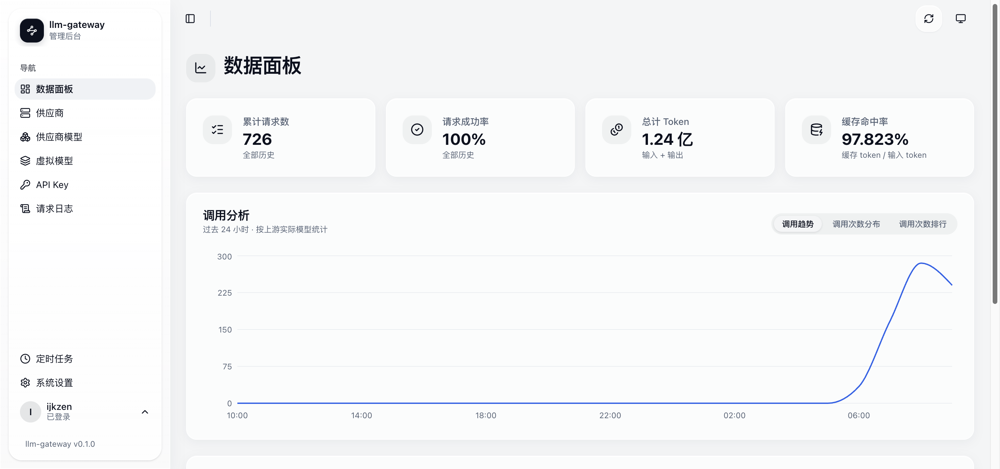
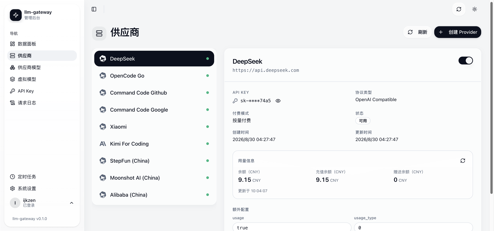
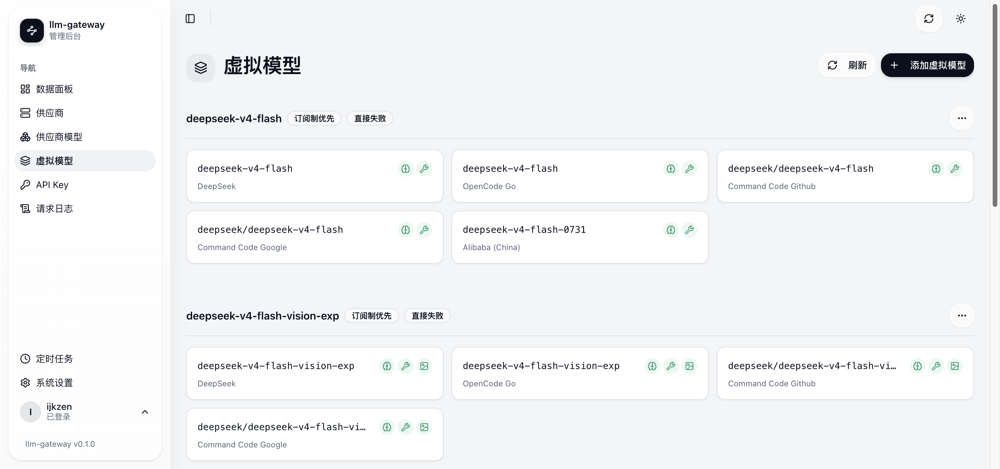
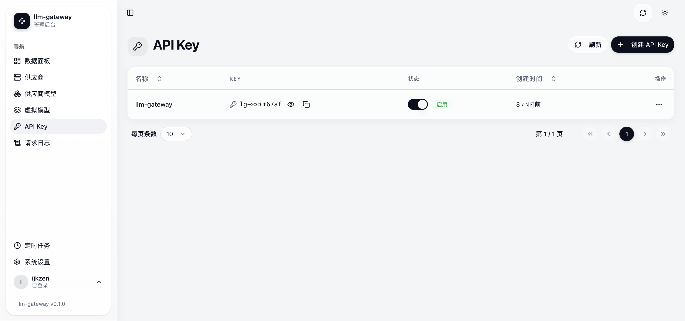
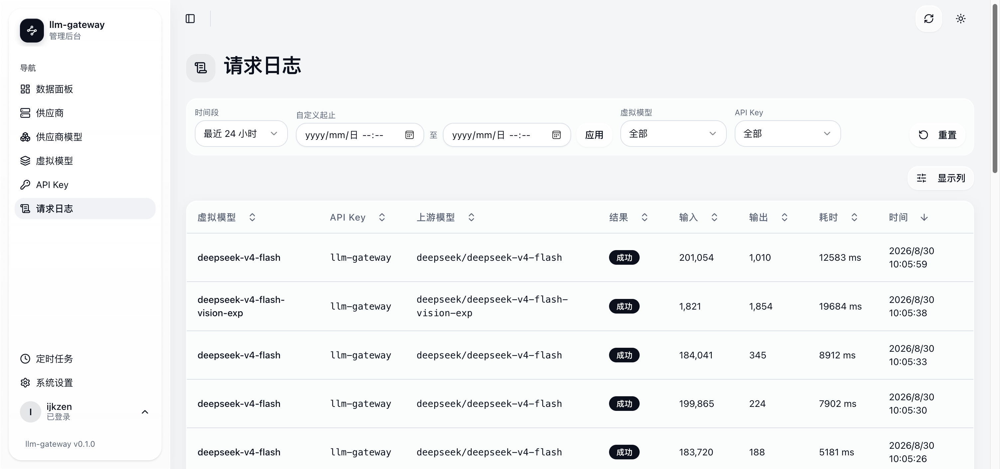

# llm-gateway

[](https://github.com/ijkzen/llm-gateway/actions/workflows/ci.yml)
[](https://github.com/ijkzen/llm-gateway/actions/workflows/nightly.yml)
[](https://github.com/ijkzen/llm-gateway/releases/latest)

一个 Rust + React 的单体 LLM API 网关：统一管理多家 LLM 供应商的 API Key 与模型，
通过「虚拟模型」做负载均衡与降级，并提供用量查询、额度门控与可视化数据面板。

把多个上游（OpenAI 兼容 / OpenAI Responses / Anthropic / Gemini 协议）聚合成一个
OpenAI 兼容的 `/v1` 入口，客户端只需一把 `lg-` API Key 即可访问全部模型。

## 功能特性

- **供应商管理**：按 `base_url` 自动套用预设模板（协议、付费模式、用量字段），AES-256-GCM 加密存储上游 API Key，支持刷新并批量导入远端模型。
- **虚拟模型聚合**：把多个供应商模型聚合成一个对外暴露的 `display_id`，支持订阅制优先 / 按量优先 / 轮转 / 随机四种负载均衡策略，成员失败自动降级重试（failover：408/429/500/502/503/529）。
- **四协议转发**：OpenAI 兼容 / OpenAI Responses / Anthropic / Gemini 请求与响应互转，流式与非流式均支持，统一归一化 usage 指标。
- **用量查询与额度门控**：内置 8+ 家厂商用量 fetcher（API Key 直查 / Copilot OAuth / 火山、阿里 AK/SK 签名 / CookieCloud cookie 系），用量自动刷新（每 5 分钟）；订阅额度耗尽的供应商自动停用、恢复后自动启用。
- **数据面板**：实时请求指标（TTFT、TPS、缓存命中率等 19 个字段），过去 24 小时按小时分桶的趋势图、按模型分布图，累计概览卡片。
- **定时任务引擎**：内置 cron 调度器（支持标准 Cron 与 `@every` 间隔），执行日志实时 SSE 推送。
- **单用户管理后台**：登录认证（argon2id）、Cookie Session、内嵌 React SPA。

## 界面预览

| 数据面板 | 供应商管理 |
| --- | --- |
|  |  |

| 虚拟模型 | API Key | 请求日志 |
| --- | --- | --- |
|  |  |  |

## 架构

```
LLM 客户端 ──POST /v1/chat/completions──> llm-gateway ──转发──> 上游（OpenAI/Anthropic/Gemini...）
                Bearer lg-xxx                    │ 虚拟模型 LB + 降级
                                                └──> SQLite（供应商、模型、用量缓存、请求指标）
```

- 后端：Rust 2024 edition + Axum 0.8 + SeaORM + SQLite（WAL 模式）
- 前端：React 19 + TypeScript + Vite 6 + shadcn/ui（内嵌进二进制，`rust-embed`）
- 转发客户端：自研 hyper 连接池（按 host 隔离复用、空闲 10 分钟释放），rustls 纯 Rust TLS，无系统 OpenSSL 依赖

## 快速开始

### 前置

- Rust（stable，2024 edition）
- Node ≥ 22 + pnpm（`corepack enable pnpm`）
- 至少一个上游 LLM 供应商 API Key

### 本地运行

```bash
# 1. 构建前端（rust-embed 在编译期嵌入 web/dist，改动前端后必须重新构建）
cd web && pnpm install --frozen-lockfile && pnpm build && cd ..

# 2. 启动服务
DATABASE_URL=sqlite://db/app.db?mode=rwc BIND_ADDRESS=0.0.0.0:4007 cargo run
```

首次启动会进入初始化流程：浏览器访问 <http://localhost:4007/> 创建管理员账号，
然后添加你的供应商 API Key 与虚拟模型，即可通过 `/v1/chat/completions` 调用。

### Docker 运行

```bash
# 从 GHCR 拉取镜像（:latest 始终指向最新正式发布版本）
docker pull ghcr.io/ijkzen/llm-gateway:latest

# 生产建议固定版本 tag（避免拉取到后续不兼容的新版本）
docker pull ghcr.io/ijkzen/llm-gateway:v0.1.10

# 尝鲜最新 main 提交（未正式发布，勿用于生产）
docker pull ghcr.io/ijkzen/llm-gateway:nightly

# 运行（挂载 /config/db 与 /config/logs 持久化数据）
docker run -d --name llm-gateway \
  -p 127.0.0.1:4007:4007 \
  -e APP_ENV=prod \
  -e DATABASE_URL=sqlite:///config/db/app.db?mode=rwc \
  -e API_KEY_ENCRYPTION_KEY=$(openssl rand -hex 32) \
  -v llm-gateway-data:/config/db \
  ghcr.io/ijkzen/llm-gateway:latest
```

> `API_KEY_ENCRYPTION_KEY` 用于加密存储上游 API Key，生产环境**必须配置**（否则明文落库）。

### Docker Compose

仓库根目录提供 [`compose.yaml`](compose.yaml) 示例：

```bash
cp .env.example .env   # 填写 API_KEY_ENCRYPTION_KEY
docker compose up -d
```

## 配置

所有配置走环境变量（默认值见 `src/config/mod.rs`）：

| 变量 | 默认值 | 说明 |
| --- | --- | --- |
| `BIND_ADDRESS` | `0.0.0.0:4007` | HTTP 监听地址 |
| `APP_ENV` | `dev` | 运行环境，`dev` 或 `prod`（prod 时数据库/日志路径切到 `/config`） |
| `DATABASE_URL` | `sqlite://db/app.db?mode=rwc` | SQLite 数据库位置 |
| `RUST_LOG` | `info,sqlx::query=warn` | tracing 日志级别 |
| `CRON_JOB_QUEUE_SIZE` | `1000` | 定时任务派发队列容量 |
| `CRON_JOB_MAX_CONCURRENT` | `10` | 定时任务最大并发执行数 |
| `API_KEY_ENCRYPTION_KEY` | 空 | 上游 API Key 的 AES-256-GCM 加密密钥（生产必配） |

## GitHub Actions 构建

- `.github/workflows/ci.yml`：push 到 main / PR 时运行测试、clippy、fmt，并构建前端。
- `.github/workflows/nightly.yml`：每次 push 到 main 构建镜像并推送到
  **Nightly 渠道**（`ghcr.io/ijkzen/llm-gateway:nightly`，覆盖式），供尝鲜，不建 Release。
- `.github/workflows/release.yml`：**只匹配 `v*` tag**。发布流程为：本地同步修改
  `Cargo.toml` 与 `web/package.json` 版本号 → 提交 → `git tag vX.Y.Z && git push origin vX.Y.Z` →
  CI 校验版本一致 → 运行测试 → 构建 `ghcr.io/ijkzen/llm-gateway:vX.Y.Z`（同时更新 `:latest`）→
  创建 [GitHub Release](https://github.com/ijkzen/llm-gateway/releases) 页（自动生成 changelog）。

镜像由仓库内 `Dockerfile` 多阶段构建（全公网依赖），可直接拉取使用。

> **发布 ≠ 部署**：正式发布走上述 GitHub Release 流程；把最新代码部署到自建
> FRP/阿里云服务器（`gateway.ijkzen.cn`）是独立的本地部署流程（zig 交叉编译 +
> `.deploy/deploy.sh`），部署不修改版本号，两者互不影响。

## 测试

```bash
cargo test --all-targets
cargo clippy --all-targets --all-features -- -D warnings
cargo fmt --check
cd web && pnpm vitest run
```

集成测试为黑盒：启动真实 app（临时目录 SQLite、随机端口）+ 本地 mock 上游，无需真实 LLM Key。

## 文档

| 文档 | 内容 |
| --- | --- |
| `CONTEXT.md` | 领域术语与语言约定 |
| `AGENTS.md` | 项目结构、构建方式与开发约定 |
| `docs/adr/` | 架构决策记录 |

## 许可

本项目以 [MIT 许可证](LICENSE) 发布。
